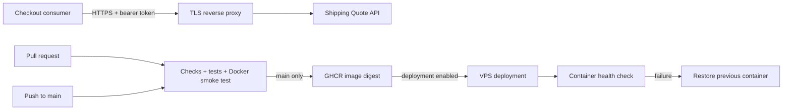

# Shipping Quote API

A small, stateless shipping quote service built with Node.js 24, Docker, and GitHub Actions. It exposes an authenticated quote endpoint plus an unauthenticated health endpoint, and includes validation, structured logging, rate limiting, container health checks, and an optional VPS deployment pipeline.

The application uses only built-in Node.js APIs. There are no runtime npm dependencies, no database, and no compilation or bundling step.

> The included rates are sample application data, not real carrier rates.

## Requirements

- Git
- Node.js 24 (`package.json` requires `>=24 <25`)
- npm
- Docker, only for container builds and smoke testing
- A GitHub account, only for CI/CD
- A Linux VPS and domain, only for production deployment

## Quick start

Create the local environment file:

```powershell
Copy-Item .env.example .env
```

Generate a secure API key:

```powershell
node -e "console.log(require('node:crypto').randomBytes(32).toString('hex'))"
```

Replace the example `API_KEY` in `.env` with the generated value. The placeholder value is deliberately rejected at startup.

Install, validate, test, and start the service:

```powershell
npm ci
npm run check
npm test
npm start
```

Verify the running API:

```powershell
Invoke-RestMethod http://127.0.0.1:3000/healthz
```

In a second terminal, run the example checkout consumer:

```powershell
npm run checkout
```

Expected checkout values:

- Cart: IDR 200,000
- Shipping: IDR 50,000
- Total: IDR 250,000

If the quote API is unavailable or returns an invalid response, checkout stops explicitly rather than treating shipping as free.

## Configuration

| Variable | Required | Default | Purpose |
|---|---|---|---|
| `API_KEY` | Yes | None | Bearer token used by quote consumers. It must contain at least 32 characters and cannot use the example placeholder. |
| `PORT` | No | `3000` | HTTP port used by the API and container health check. |
| `API_BASE_URL` | No | `http://127.0.0.1:3000` | API origin used by the example checkout client. |

Local npm commands load `.env` through Node's `--env-file` option. The file is ignored by Git and excluded from the Docker build context. Do not commit real credentials.

## Development commands

| Command | Purpose |
|---|---|
| `npm start` | Start the API from `src/server.js` using `.env`. |
| `npm run checkout` | Run the example consumer against `API_BASE_URL`. |
| `npm run check` | Run `node --check` against the JavaScript source, tests, and scripts. |
| `npm test` | Run unit and HTTP integration tests with the built-in Node test runner. |

`npm run check` verifies syntax only; the project does not currently configure ESLint or a formatter.

## API

### Health check

```http
GET /healthz
```

Authentication is not required.

```json
{"status":"ok"}
```

This is a process-liveness check. It does not verify external dependencies because the service currently has none.

### Create a shipping quote

```http
POST /v1/quotes
Authorization: Bearer API_KEY
Content-Type: application/json
```

Example request:

```json
{"zone":"domestic","weightGrams":1500}
```

Example response:

```json
{"currency":"IDR","amount":50000,"billableKg":2,"rateVersion":"2026-01"}
```

### Validation and pricing

- The maximum request body size is 4,096 bytes.
- Unknown fields are rejected.
- `weightGrams` must be an integer from 1 through 30,000.
- Billable weight is rounded up to the next whole kilogram.
- Monetary values are integer IDR amounts.

| Zone | Sample rate |
|---|---:|
| `local` | IDR 10,000/kg |
| `domestic` | IDR 25,000/kg |

### Error responses

| Status | Meaning |
|---|---|
| `400` | Invalid JSON or aborted request |
| `401` | Missing or incorrect bearer token |
| `404` | Route not found |
| `405` | Method not allowed |
| `413` | Request body exceeds 4,096 bytes |
| `415` | Content type is not `application/json` |
| `422` | Quote input fails validation |
| `429` | Rate limit exceeded |

Rate-limited responses include `Retry-After`. All responses include `X-Request-Id`, `Cache-Control: no-store`, and `X-Content-Type-Options: nosniff`.

Request logs are emitted as structured JSON with the request ID, method, status, and duration. Bearer tokens and request bodies are not logged.

## Architecture



The service is stateless and does not persist orders. `src/app.js` creates the HTTP server, while `src/server.js` is the executable entry point that reads configuration, starts listening, and handles graceful shutdown. The checkout example runs as a separate consumer process.

For design decisions and security tradeoffs, see [`docs/ARCHITECTURE.md`](docs/ARCHITECTURE.md).

## Tests and CI/CD

Tests in `test/api.test.js` cover pricing, input validation, API-key validation, the HTTP contract, authentication, malformed requests, rate limiting, safe logging, health checks, and checkout failure behavior.

The workflow in `.github/workflows/pipeline.yml` responds to:

| Trigger | Test | Publish image | Deploy |
|---|:---:|:---:|:---:|
| Pull request | Yes | No | No |
| Push to `main` | Yes | Yes | Only when enabled |
| Manual workflow dispatch on `main` | Yes | Yes | Only when enabled |

The test job runs source checks, automated tests, Bash syntax validation, a Docker build, and live container smoke tests. Successful main-branch builds are published to GitHub Container Registry using an immutable image digest.

Deployment remains disabled until the repository Actions variable `DEPLOY_ENABLED` is set to `true`. The deployment job uses verified SSH host keys, starts the new container with restricted privileges and resource limits, waits for its Docker health check, and restores the previous container if verification fails.

See [`docs/DEPLOYMENT.md`](docs/DEPLOYMENT.md) for the complete VPS, GHCR, DNS, TLS, and rollback runbook.

## Run with Docker

With a valid `.env` file:

```powershell
docker build -t shipping-quote:local .
docker run --rm --name shipping-quote-local --env-file .env -p 127.0.0.1:3000:3000 shipping-quote:local
```

The image contains only `src/`, runs as the non-root `node` user, and defines `src/healthcheck.js` as its health probe.

## Repository structure

```text
src/
  app.js                    HTTP routing, security, and request handling
  healthcheck.js            Container health probe
  quote.js                  Quote validation and pricing rules
  server.js                 Process startup and graceful shutdown

examples/
  checkout-client.js        Example API consumer

test/
  api.test.js               Unit, contract, security, and integration tests

scripts/
  check-syntax.js           JavaScript syntax verification
  deploy.sh                 Digest-based VPS deployment and rollback
  verify-quote-response.js  CI smoke-test response verification

.github/workflows/
  pipeline.yml              Test, image publishing, and deployment workflow

docs/
  ARCHITECTURE.md           Architecture decisions, limits, and tradeoffs
  DEPLOYMENT.md             Deployment and recovery runbook
```

## Security and operational limits

The project includes bearer-token authentication, strict input validation, bounded request bodies, server timeouts, process-local rate limiting, request IDs, structured logs, a non-root container, and automated deployment rollback.

Before treating it as a production system, understand these constraints:

- One shared API key provides machine authentication, but no users, roles, tenants, expiry, or per-client revocation.
- The default limiter allows 60 business requests per minute and is shared by all callers in one process, including failed authentication attempts. It is not coordinated across replicas.
- `/healthz` reports liveness only.
- Remote traffic requires TLS termination and edge-level connection and abuse controls.
- Deployment replaces a container on one server and can cause brief downtime.
- Monitoring, alerting, distributed tracing, autoscaling, persistent metrics, and vulnerability scanning are not included.
- GitHub Actions and the Node base image currently use version tags rather than reviewed immutable digests.

See [`docs/ARCHITECTURE.md`](docs/ARCHITECTURE.md) before changing authentication, validation, rate limiting, networking, or deployment behavior.

## Documentation

- [`docs/ARCHITECTURE.md`](docs/ARCHITECTURE.md) — boundaries, security decisions, and known limitations
- [`docs/DEPLOYMENT.md`](docs/DEPLOYMENT.md) — local Docker usage and production deployment
- [`AGENTS.md`](AGENTS.md) — repository-specific guidance for AI-assisted changes
