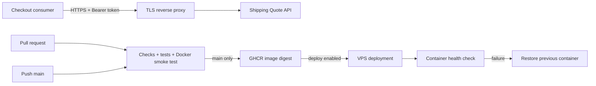

# Shipping Quote API

A lightweight shipping quote API built with Node.js 24, Docker, and GitHub Actions.  
The service exposes authenticated quote calculation, request validation, health checks, structured logging, rate limiting, containerization, and an automated CI/CD pipeline.

No runtime npm dependencies are required.

## Requirements

- Git
- Node.js 24
- npm
- Docker for container builds and smoke testing
- A GitHub account for CI/CD execution
- A Linux VPS and domain only when enabling deployment

## Local Setup

Create the local environment file:

```powershell
Copy-Item .env.example .env
```

Generate a secure API key:

```powershell
node -e "console.log(require('node:crypto').randomBytes(32).toString('hex'))"
```

Set the generated value as `API_KEY` in `.env`.

Install, validate, test, and start the service:

```powershell
npm ci
npm run check
npm test
npm start
```

In a second terminal:

```powershell
npm run checkout
```

Expected checkout result:

- Cart: IDR 200,000
- Shipping: IDR 50,000
- Total: IDR 250,000

If the API is unavailable, the example checkout client fails explicitly rather than treating shipping as free.

The configured rates are sample application data and are not real carrier rates.

## Architecture



The API is stateless and does not persist orders.

The included checkout client is a separate consumer process that requests a quote and calculates the cart total.

For architecture decisions, tradeoffs, and known security limitations, see [`docs/ARCHITECTURE.md`](docs/ARCHITECTURE.md).

## API

### Health Check

```http
GET /healthz
```

Authentication is not required.

Response:

```json
{"status":"ok"}
```

### Create Shipping Quote

```http
POST /v1/quotes
Authorization: Bearer API_KEY
Content-Type: application/json
```

Example request:

```json
{"zone":"domestic","weightGrams":1500}
```

Example response:

```json
{"currency":"IDR","amount":50000,"billableKg":2,"rateVersion":"2026-01"}
```

### Validation Rules

- Request body maximum size: 4096 bytes
- Unknown fields are rejected
- `weightGrams` must be an integer between 1 and 30000
- Billable weight is rounded up to the next whole kilogram
- Prices are represented as integer IDR amounts

Configured sample rates:

| Zone | Rate |
|---|---:|
| `local` | IDR 10,000/kg |
| `domestic` | IDR 25,000/kg |

### Error Responses

| Status | Meaning |
|---|---|
| `400` | Invalid JSON |
| `401` | Authentication failure |
| `404` | Route not found |
| `405` | Method not allowed |
| `413` | Request body too large |
| `415` | Unsupported content type |
| `422` | Invalid input |
| `429` | Rate limit exceeded |

Rate-limited responses include `Retry-After`.

The service also provides request IDs and structured JSON logs while avoiding logging API tokens or request bodies.

## CI/CD Pipeline

The GitHub Actions workflow performs:

1. Source checks
2. Automated tests
3. Docker build and smoke test
4. Container publishing to GitHub Container Registry on `main`
5. Optional VPS deployment when deployment is explicitly enabled
6. Post-deployment health verification
7. Rollback if the deployed container fails its health check

Deployment is disabled until `DEPLOY_ENABLED=true`.

A successful CI run confirms that the configured workflow steps completed successfully; deployment status depends on the deployment configuration and environment.

## Repository Structure

```text
src/
  app.js                    HTTP routing, security, and request handling
  healthcheck.js            Container health probe
  quote.js                  Quote validation and pricing rules
  server.js                 Server startup and shutdown

examples/
  checkout-client.js        Example API consumer

test/
  api.test.js               Contract, auth, validation, rate-limit, and logging tests

.github/workflows/
  pipeline.yml              CI/CD workflow

scripts/
  check-syntax.js           JavaScript syntax verification
  deploy.sh                 Digest-based deployment and health-check rollback
  verify-quote-response.js  CI smoke-test response verification

docs/
  ARCHITECTURE.md           Architecture decisions and tradeoffs
  DEPLOYMENT.md             Deployment runbook
```

## Security Notes

The implementation includes:

- Bearer-token authentication
- Strict JSON input validation
- Request size limits
- Rate limiting
- Request IDs
- Structured logging
- No logging of bearer tokens or request bodies
- Container health checks
- Automated rollback support

For production use, additional controls should be considered, including secret management, TLS termination, dependency and image scanning, monitoring, alerting, and reviewed immutable action/base-image digests.

## Documentation

- [`docs/ARCHITECTURE.md`](docs/ARCHITECTURE.md)
- [`docs/DEPLOYMENT.md`](docs/DEPLOYMENT.md)
